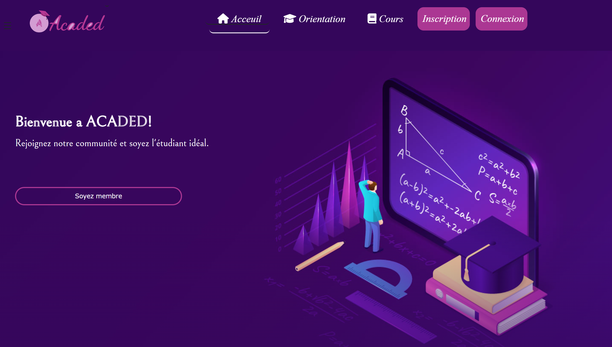
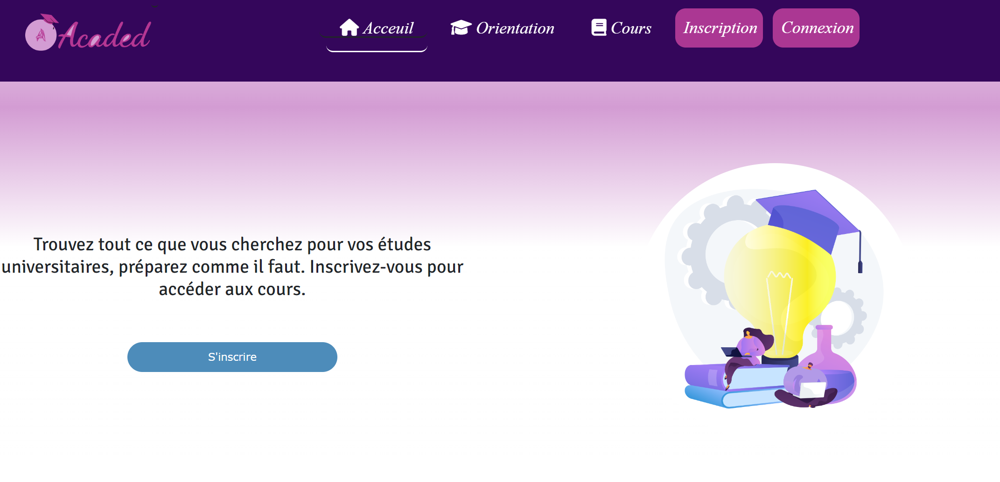
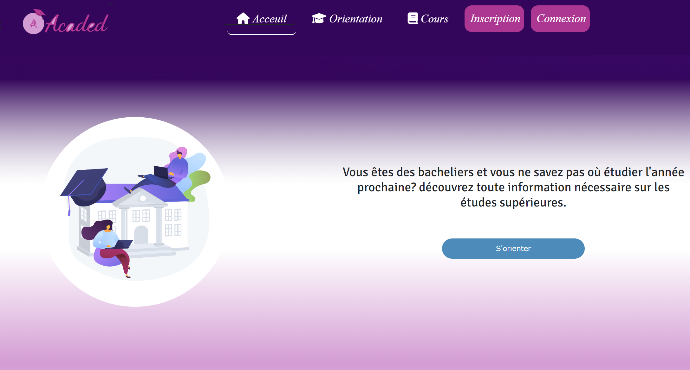
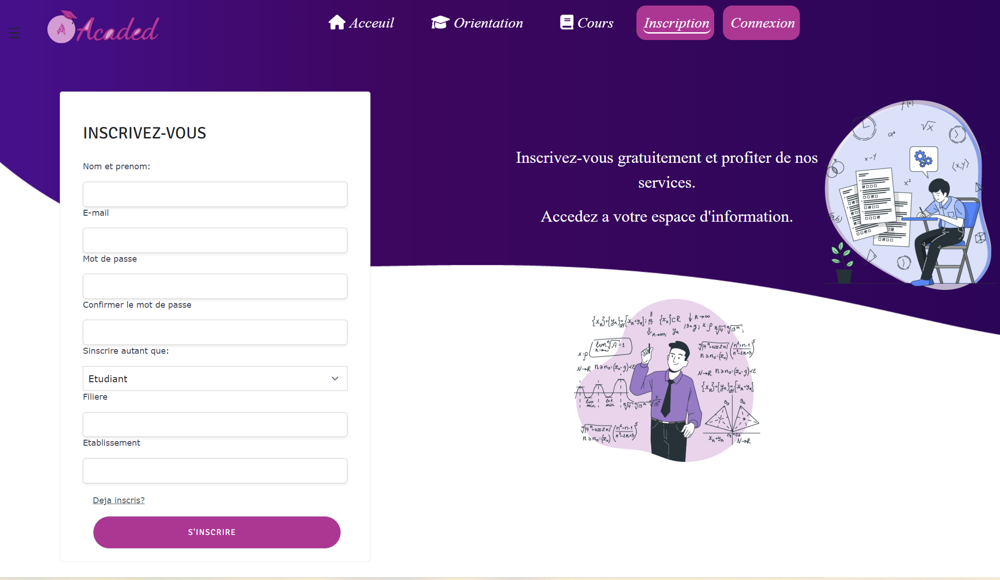
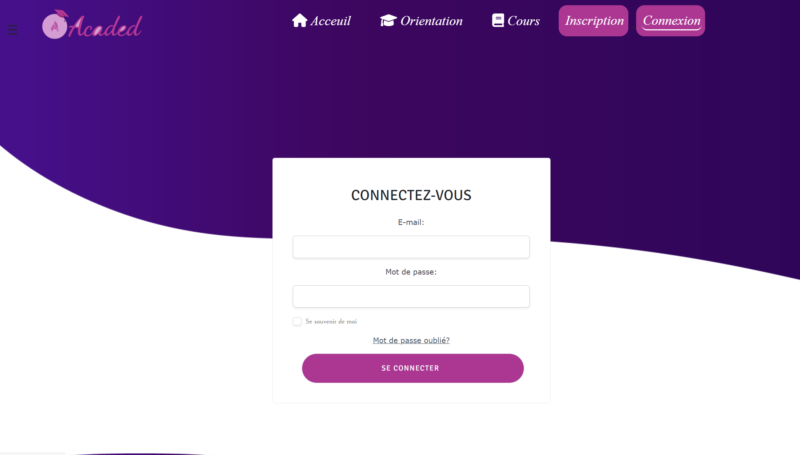
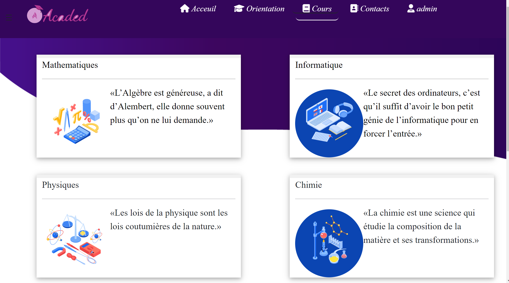
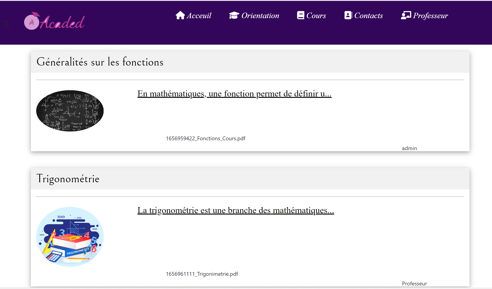
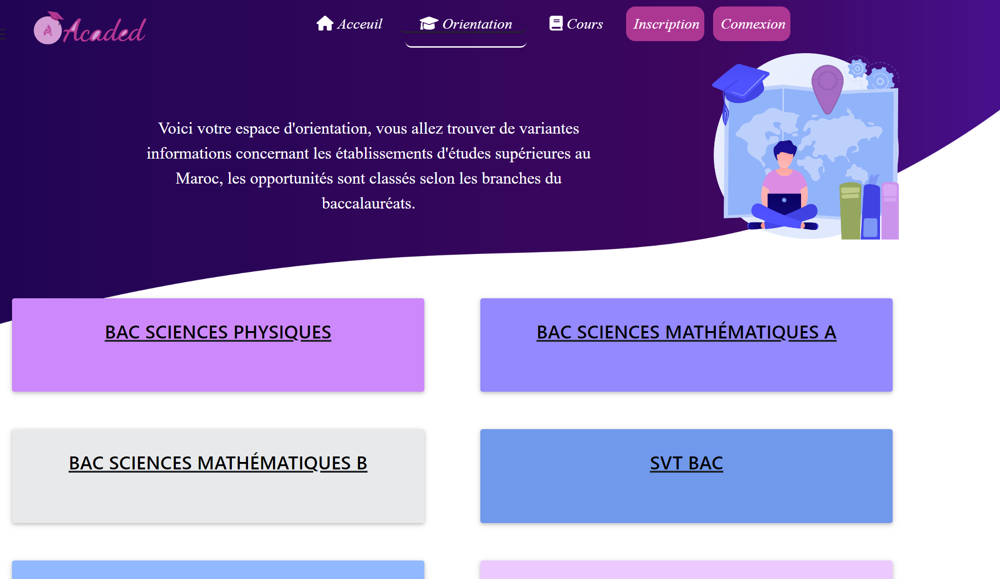
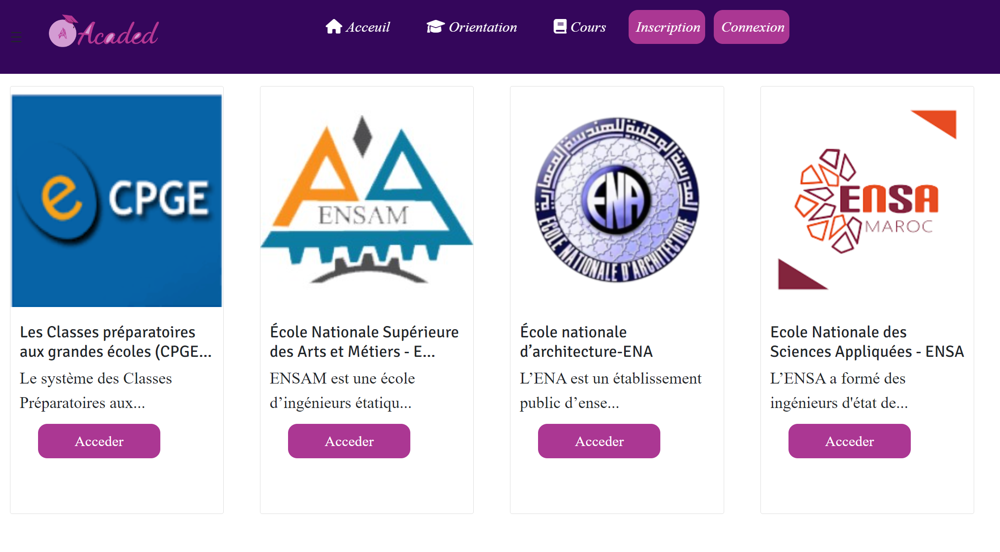
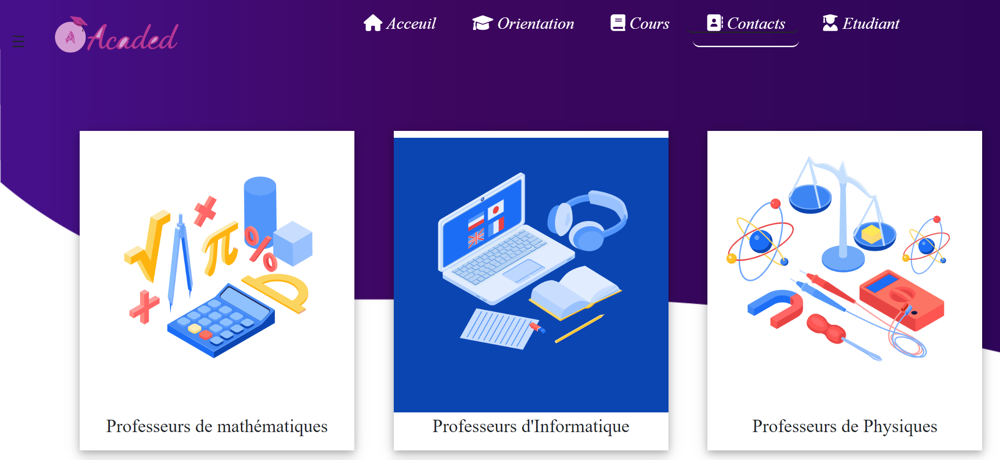

# E-learning and orientation platform_ ACADED
  A platform made for university students and high school graduates provides courses and orientation informations, developed using the framework Laravel.
# Platform 

# This is the inscription page 

# This is the connection page

# This is the page containing the courses available for signed up students

# This is the orientation section where we offer informations about universities 

# Here we list the professors engaged with our platform 

